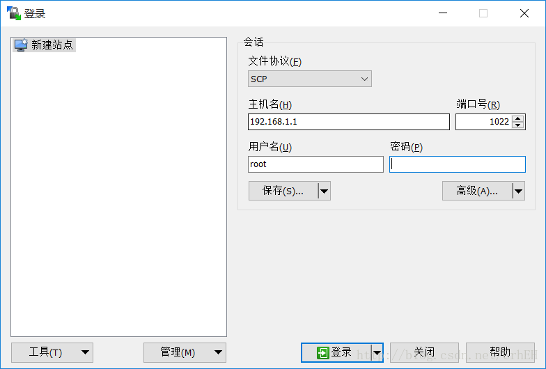
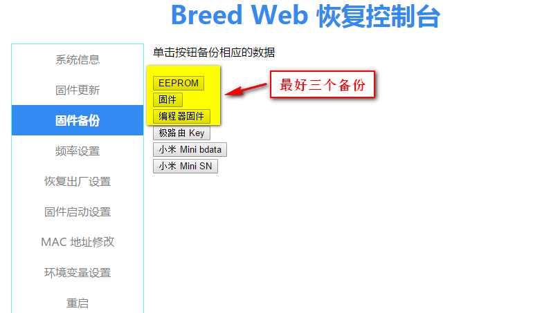
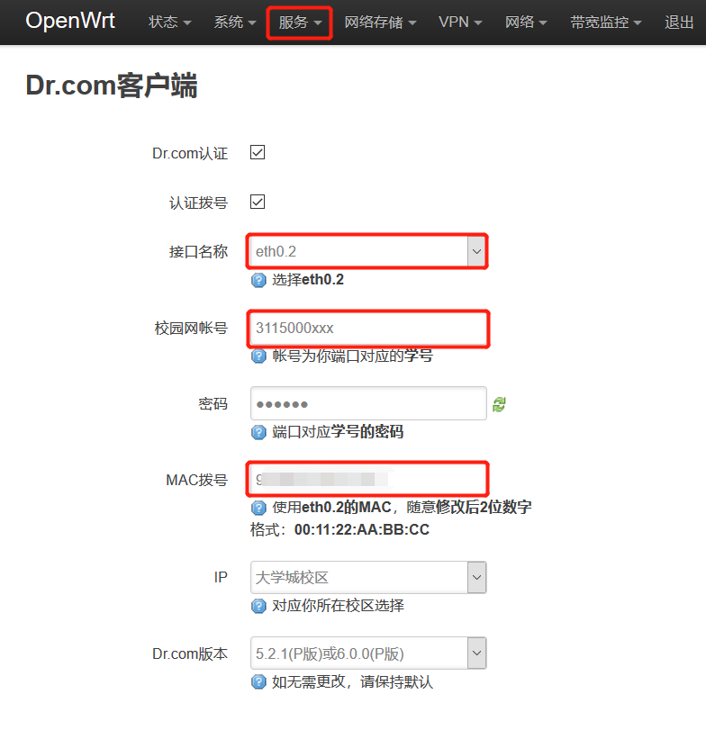
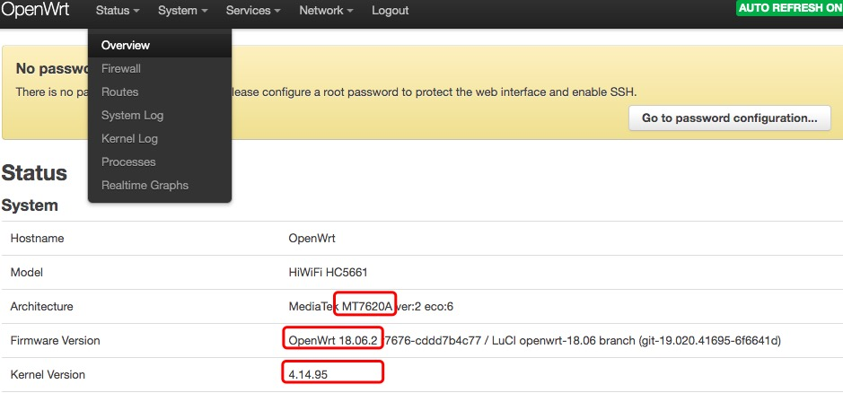

<p align="center">
  <a href="https://openwrt.org/"></a>
</p>

<p align="center">
    <a href="https://github.com/shengqiangzhang/Drcom-GDUT-HC5661A-OpenWrt"></a>
    <a href="https://github.com/shengqiangzhang/Drcom-GDUT-HC5661A-OpenWrt"></a>
    <a href="https://opensource.org/licenses/GPL-3.0"></a>
    <a href="https://github.com/shengqiangzhang/Drcom-GDUT-HC5661A-OpenWrt/stargazers"></a>
    <a href="https://github.com/shengqiangzhang/Drcom-GDUT-HC5661A-OpenWrt/network/members"></a>
</p>


<br /><br />
* [免责声明](#免责声明)
* [前言](#前言)
* [准备工作](#准备工作)
* [步骤一:获取路由器root权限](#步骤一获取路由器root权限)
* [步骤二:刷入不死Breed](#步骤二刷入不死breed)
  * [下载Breed](#下载breed)
  * [上传到指定目录](#上传到指定目录)
  * [刷入Breed](#刷入breed)
* [步骤三:刷入OpenWrt 系统固件](#步骤三刷入openwrt-系统固件)
  * [下载对应的OpenWrt系统固件](#下载对应的openwrt系统固件)
  * [开始刷入OpenWrt固件](#开始刷入openwrt固件)
* [步骤四:安装Dr.com插件](#步骤四安装drcom插件)
  * [安装现成Drcom插件](#安装现成Drcom插件)
  * [自己编译Drcom插件](#自己编译Drcom插件)
* [步骤五:配置上网](#步骤五配置上网)
* [步骤六:配置防检测](#步骤六配置防检测)
  * [安装现成xmurp-ua插件](#安装现成xmurp-ua插件)
  * [自己编译xmurp-ua插件](#自己编译xmurp-ua插件)
* [疑惑解答](#疑惑解答)
* [补充](#补充)
* [License](#license)


<br /><br />
# 免责声明
> 1. 在根据本教程进行实际操作时，如因您操作失误导致出现的一切意外，包括但不限于路由器变砖、故障、数据丢失等情况，概不负责；
> 2. 该技术仅供学习交流，请勿将此技术应用于任何商业行为，所产生的法律责任由您自行承担；
> 3. 部分学校明令禁止使用路由器上网，相关文件请点击[广东工业大学校园网责任书][gdut-letter-of-responsibility]、[厦门大学校园网责任书][xmu-letter-of-responsibility]查看。本教程仅用于交流使用，安装路由器的行为完全是您个人意志所决定的，如您已成功安装，请在 24 小时内重置路由器至原出产状态；
> 4. 请按照学校推荐的方式连接到互联网，如因个人问题受到相关校规追责，由您自行承担。


<br /><br />
# QQ交流群

欢迎加入QQ交流群，群号748317786，仅限技术交流，禁止商业行为


<br /><br />
# 前言

本教程教您如何在[Drcom][drcom-introduction]下使用路由器上校园网(以广东工业大学、极路由1S HC5661A为例)

本教程适合使用[Drcom][drcom-introduction]进行拨号上网的用户，同时，要求您的路由器支持刷入第三方系统，如openwrt。由于是针对新手的教程，所以叙述部分可能会比较冗杂，您可自行跳到不同的章节。

本教程以极路由1S HC5661A为例，不同型号路由器所对应的教程略有不同，请您注意。


**本教程非原创，在以下开发者的基础上进行改进:**

1. [陈浩南: 在厦大宿舍安装路由器][chenhaonan]
2. [NickHopps: 开启愉快的路由之旅：广工校园网Wifi][NickHopps]
3. [GJXS: 绕过检测移动设备的一种思路][GJXS]


<br /><br />
# 准备工作

- 一款支持刷入第三方系统([openwrt](https://openwrt.org/))的路由器
- **该路由器已联网并获得开发者(root)权限**
- **一根网线**
- 下载软件[WinSCP](./software/WinSCP-5.13.7-Setup.exe)
- 下载软件putty，32位操作系统请下载[putty32](./software/putty32.exe)，64位系统请下载[putty64](./software/putty64.exe)


<br /><br />
# 步骤一:获取路由器root权限

以`极路由1S HC5661A`为例，在您购买满14天后，请先登录极路由器后台，然后依次开通、安装开发者插件

- [x] 开通开发者模式：“云插件”>“路由器信息”>“高级设置”>“开通” 
- [x] 安装开发者插件：“云插件”>“全部插件”>“开发者模式”>”确定” 

其他路由器可查看其他教程获取root权限。


<br /><br />
# 步骤二:刷入不死Breed

## 下载Breed

[Breed](https://breed.hackpascal.net/)是一个路由器的Bootloader（Bootloader 意为引导加载器，即为用于加载操作系统的程序。它是一大类此类功能程序的统称。现在的 BIOS、UEFI、GRUB、RedBoot、U-Boot、CFE等都是 Bootloader），装它的目的是为了下一步刷入固件（ROM）。以`极路由1S HC5661A`为例，**不同型号下载不同的Breed，请务必对号入座**，下载[breed-mt7628-hiwifi-hc5661a.bin](./breed/breed-mt7628-hiwifi-hc5661a.bin)

以下是几种常见的路由器型号对应的Breed下载链接：

| 路由器版本号                      | 下载链接地址                                                 |
| --------------------------------| ---------------------------------------------------------- |
| 极路由1(HC6361)                  | [HC6361-uboot][HC6361-uboot]                               |
| 极路由1S(HC5661**A**)            | [breed-mt7628-hiwifi-hc5661a][breed-mt7628-hiwifi-hc5661a] |
| 极路由1S(HC5661)/极路由2(HC5761)  | [breed-mt7620-hiwifi-hc5761][breed-mt7620-hiwifi-hc5761]   |
| 极路由3(HC5861)                  | [breed-mt7620-hiwifi-hc5861][breed-mt7620-hiwifi-hc5861]   |
| 极路由4(HC5962)                  | [breed-mt7621-hiwifi-hc5962][breed-mt7621-hiwifi-hc5962]   |
| -                               | -                                                          |
| 小米路由器mini版                  | [breed-mt7620-xiaomi-mini][breed-mt7620-xiaomi-mini]       |
| -                               | -                                                          |
| 新路由mini(newifi y1)            | [breed-mt7620-lenovo-y1][breed-mt7620-lenovo-y1]           |
| 新路由1(newifi y1s)              | [breed-mt7620-lenovo-y2][breed-mt7620-lenovo-y2]           |
| 新路由2(newifi d1)               | [breed-mt7621-newifi-d1][breed-mt7621-newifi-d1]           |
| 新路由3(newifi d2)               | [breed-mt7621-newifi-d2][breed-mt7621-newifi-d2]           |
| -                               | -                                                          |
| 斐讯K1、K2一键刷Breed工具包        | 链接: [斐讯路由器刷breed Web助手通用版][phicomm-breed]，提取码: 5kjc<br />斐讯路由器类型的，刷完可直接跳到[步骤三](#下载对应的OpenWrt系统固件) |


> `说明:`由于路由器版本太多，若您在上面没有找到对应的路由器型号，请自行查找


## 上传到指定目录

使用WinSCP登入你的路由器后台，其中：

主机名: **你的后台管理地址(比如192.168.1.1或者192.168.1.199或者其他)**

账号: **root**

密码: **你的后台管理密码，如果忘记请恢复出产设置**

端口: **1022或者22(自行测试)**

模式: **SCP** 




登陆成功后进入`/tmp目录`，将刚才下载的[breed-mt7628-hiwifi-hc5661a.bin](./breed/breed-mt7628-hiwifi-hc5661a.bin)上传到这个目录


## 刷入Breed

使用[putty64](./software/putty64.exe)登入你的路由器后台，主机名称、账号、密码、端口均与上述相同。连接类型选择**SSH**，然后点击**打开**按钮。

然后等一会，窗口会弹出**login as:**，此时输入账号**root**

接着，窗口会弹出**password as:**，此时输入**后台管理密码。注意，输入密码的时候，密码不会显示在窗口上，需要靠感觉输入密码。**

> linux系统的登录方式是基本知识，但是考虑到的确有一部分人对计算机完全不懂，所以才会介绍那么详细。


登入成功后键入以下命令: 

`mtd -r write /tmp/breed-mt7628-hiwifi-hc5661a.bin u-boot` 

如果是小米路由器mini，则键入以下命令:

`mtd -r write /tmp/breed-mt7620-xiaomi-mini.bin Bootloader`


显示rebooting后等待路由重启完成，不死uboot就完成了刷入了。（注意，为了确定百分百刷入成功，建议此时什么都不要动，等待5分钟后再进行其他操作）


<br /><br />
# 步骤三:刷入OpenWrt 系统固件

## 下载对应的OpenWrt系统固件

键入以下命令查看`路由器CPU的型号`，以确定我们要刷什么版本的固件

`cat /proc/cpuinfo`


点击这里[OpenWrt Downloads](http://downloads.openwrt.org/releases/18.06.2/targets/)下载对应型号的OpenWrt固件，以`极路由1S HC5661A`为例,点击下载[openwrt-18.06.2-ramips-mt76x8-hc5661a-squashfs-sysupgrade.bin](./openwrt/openwrt-18.06.2-ramips-mt76x8-hc5661a-squashfs-sysupgrade.bin)

如下图:


以下是几种常见的路由器型号对应的OpenWrt固件下载链接：

| 路由器版本号           | CPU的架构      | 下载链接地址                                                         |
| -------------------- | ------------- | ------------------------------------------------------------------ |
| 极路由1(HC6361)       | ar71xx-generic| [openwrt-18.06.2-ar71xx-generic-hiwifi-hc6361.bin][openwrt-hc6361] |
| 极路由1S(HC5661**A**) | ramips/mt76x8 | [openwrt-18.06.2-ramips-mt76x8-hc5661a.bin][openwrt-hc5661a]       |
| 极路由1S(HC5661)      | ramips/mt7620 | [openwrt-18.06.2-ramips-mt7620-hc5661.bin][openwrt-hc5661]         |
| 极路由2(HC5761)       | ramips/mt7620 | [openwrt-18.06.2-ramips-mt7620-hc5761.bin][openwrt-hc5761]         |
| 极路由3(HC5861)       | ramips/mt7620 | [openwrt-18.06.2-ramips-mt7620-hc5861.bin][openwrt-hc5861]         |
| 极路由4(HC5962)       | ramips/mt7621 | [openwrt-18.06.2-ramips-mt7621-hc5962.bin][openwrt-hc5962]         |
| -                    | -             | -                                                                  |
| 斐讯K1版              | ramips-mt7620 | [openwrt-18.06.2-ramips-mt7620-psg1208.bin][openwrt-psg1208]       |
| 斐讯K2版 （五个网口）   | ramips-mt7620 | [openwrt-18.06.2-ramips-mt7620-psg1218a.bin][openwrt-psg1218a]     |
| 斐讯K2C版（四个网口）   | ramips-mt7620 | [openwrt-18.06.2-ramips-mt7620-psg1218b.bin][openwrt-psg1218b]     |
| 斐讯K2P版（无线驱动）   | ramips-mt7621 | [openwrt-R9.10.1-4.14.146-32-mt7621-k2p-wifi.zip][openwrt-k2p]     |
| -                    | -             | -                                                                  |
| 小米路由器mini版       | ramips-mt7620 | [openwrt-18.06.2-ramips-mt7620-miwifi-mini.bin][openwrt-mifi-mini] |
| -                    | -             | -                                                                  |
| 新路由mini(newifi y1) | ramips-mt7620 | [y1-squashfs-sysupgrade.bin][y1-squashfs-sysupgrade.bin]           |
| 新路由1(newifi y1s)   | ramips-mt7620 | [y1s-squashfs-sysupgrade.bin][y1s-squashfs-sysupgrade.bin]         |
| 新路由2(newifi d1)    | ramips-mt7621 | [d1-squashfs-sysupgrade.bin][d1-squashfs-sysupgrade.bin]           |
| 新路由3(newifi d2)    | ramips-mt7621 | [d2-squashfs-sysupgrade.bin][d2-squashfs-sysupgrade.bin]           |

> `说明:`由于路由器版本太多，若您在上面没有找到对应的路由器型号，请自行查找


## 开始刷入OpenWrt固件

本小节的步骤请严格按照先后顺序操作。

1. 用网线让路由器的LAN口与电脑的网口相连接； 
2. PC设置为自动获取IP(一般默认自动获取IP)；
3. 路由器断电(就是拔插头)； 
4. 首先按住reset不放！，确保没有松开reset键后，然后，插入路由器电源； 
5. 保持按住reset 3-4秒左右，路由器灯开始一闪一闪的时候，松开reset；
6. PC网卡获取到192.168.1.x的地址 （如未获取到手工设置），一般是192.168.1.1 ；
7. 浏览器访问 192.168.1.1，接着你就会看到一个uboot控制台的界面。


为了保险起见，首先进行固件备份，以备不时之需。严重强烈建议极路由用户刷Breed后，第一次进入后台就备份一次，这样以后想要重新刷回官方系统时原有功能不会受到影响，仍然能够访问云平台。




现在正式开始刷入OpenWrt固件，依次点击固件更新→勾选固件→点击选择文件，选择我们刚刚下载的[openwrt-18.06.2-ramips-mt76x8-hc5661a-squashfs-sysupgrade.bin](./openwrt/openwrt-18.06.2-ramips-mt76x8-hc5661a-squashfs-sysupgrade.bin)，然后耐心等待固件刷入完成。


安装完成后会自动重启，这时可以不断刷新浏览器，直到管理界面显示出来，如果没有显示，建议稍后使用192.168.1.1访问管理页面。

账号:**root**

密码:**默认没有密码或者默认密码为password**


<br /><br />
# 步骤四:安装Dr.com插件

**Dr.com插件仅适用于使用Dr.com客户端认证(PPPoE,P版)的用户，主要是进行模拟拨号，定时发送心跳包的作用。使用Dr.com网页版认证(DHCP,D版)或者不使用Dr.com认证进行上网的用户不需要安装Dr.com插件。**

<br /><br />
## 安装现成Drcom插件

这里以`广工(广东工业大学)校园网为例`，其他学校请自行获得相应的Dr.com插件，如果您愿意折腾的话，可以[点击这里](https://github.com/drcoms/drcom-generic)自行编译合适自己的学校的Dr.com插件(需要较强的编程基础，建议还是找对应自己学校的现成的插件)

以下是`广工(广东工业大学)校园网`各个路由器相应版本Dr.com插件下载


| 路由器版本号                                         | CPU的架构      | 下载链接地址                       |
| -------------------------------------------------- | --------------|--------------------------------- |
| GDUT-极路由HC5661, HC5761, HC5861                   | ramips/mt7620 | [下载链接地址][gdut-drcom-hc5661]  |
| GDUT-极路由HC5661A, HC5861B                         | ramips/mt76x8 | [下载链接地址][gdut-drcom-hc5661a] |
| GDUT-极路由HC5962                                   | ramips/mt7621 | [下载链接地址][gdut-drcom-hc5962]  |
| GDUT-极路由HC6361                                   | ar71xx-generic| [下载链接地址][gdut-drcom-hc6361]  |
| -                                                  | -             | -                                |
| GDUT-斐讯K2T版                                      | ramips-mt7621 | [下载链接地址][gdut-drcom-k2t]     |
| GDUT-斐讯K2P版                                      | ramips-mt7621 | [下载链接地址][gdut-drcom-k2p]     |
| GDUT-斐讯K1, K2，K2G, K2C                           | ramips-mt7620 | [下载链接地址][gdut-drcom-psg1208] |
| -                                                  | -             | -                                |
| GDUT-小米路由器mini版                                | ramips/mt7620 | [下载链接地址][gdut-drcom-hc5661]  |
| -                                                  | -             | -                                |
| GDUT-新路由mini(newifi y1), 新路由1(newifi y1s)      | ramips/mt7620 | [下载链接地址][gdut-drcom-hc5661]  |
| GDUT-新路由2(newifi d1), 新路由3(newifi d2)          | ramips/mt7621 | [下载链接地址][gdut-drcom-k2p]     |
| -                                                  | -             | -                                |
| GDUT-ramips-rt305x                                 | ramips-rt305x | [下载链接地址][gdut-drcom-rt305x]  |
| GDUT-ar71xx_tiny                                   | ar71xx_tiny   | [下载链接地址][gdut-ar71xx-tiny]   |

> `说明:`由于路由器版本太多，若您在上面没有找到对应的路由器型号，建议选择自己编译(难度很低)


将下载的`Dr.com插件`用`WinSCP`传到路由器`/tmp`文件夹下(WinSCP的使用方式上面已经阐述过)。

打开并登录putty，进行安装Dr.com，请键入以下命令：

```Bash
cd /tmp

opkg install gdut-drcom_6.0-4_mipsel_24kc.ipk
```

**至此，Dr.com插件安装完毕。**


<br /><br />
## 自己编译Drcom插件

对于没有上述对应型号路由器的`广工(广东工业大学)同学`，可进行以下步骤进行编译生成自己的Dr.com插件.

1.首先`路由器CPU的型号`，键入以下命令查看`cat /proc/cpuinfo`

2.然后进入[OpenWrt 18.06](https://archive.openwrt.org/releases/18.06.0/targets/)，根据自己路由器的`路由器型号`进入相应的网站,`以极路由HC5661A为例`,进入[ramips/mt76x8](https://archive.openwrt.org/releases/18.06.0/targets/ramips/mt76x8/)，找到[openwrt-sdk-18.06.0-ramips-mt76x8_gcc-7.3.0_musl.Linux-x86_64.tar.xz](https://archive.openwrt.org/releases/18.06.0/targets/ramips/mt76x8/openwrt-sdk-18.06.0-ramips-mt76x8_gcc-7.3.0_musl.Linux-x86_64.tar.xz)并下载

3.在linux系统下(建议debian或者ubuntu)，键入以下命令：

```Bash
# 本次交叉编译过程在 Debian 8.9 系统下完成

# 先更新包列表
sudo apt-get update

# 安装ncurses，不同Linux版本执行不同命令
# Debian/Ubuntu 执行下面这1条命令，2选1
sudo apt-get install libncurses5-dev libncursesw5-dev
# CentOS 执行下面这条命令，2选1
yum install ncurses-devel ncurses

# 再次更新包列表
sudo apt-get update

# 安装awk，执行过程中有任何提示，请输入Y确认
sudo apt-get install gawk

# 安装git，执行过程中有任何提示，请输入Y确认
sudo apt-get install git

# 返回到当前用户目录，建议在当前用户目录下完成我们的工作，最好不要在root下
cd ~

# 在线下载相应的openwrt-sdk，这一步网络比较慢，下载可能比较久
# 如果你想加快速度，则请从其他电脑*fan*qiang*下载完成后传输到这个位置(也就是当前用户目录)
wget https://archive.openwrt.org/releases/18.06.0/targets/ramips/mt76x8/openwrt-sdk-18.06.0-ramips-mt76x8_gcc-7.3.0_musl.Linux-x86_64.tar.xz

# 解压我们刚刚下载的openwrt-sdk，请务必确保该压缩包已经位于当前目录
tar xvJf openwrt-sdk-18.06.0-ramips-mt76x8_gcc-7.3.0_musl.Linux-x86_64.tar.xz

# 进入该sdk文件夹
cd openwrt-sdk-18.06.0-ramips-mt76x8_gcc-7.3.0_musl.Linux-x86_64

# 然后再进入package文件夹，并下载drcom ODP文件夹
cd package && git clone https://github.com/GJXS1980/ODP.git

# 返回上层目录，也就是为了回到openwrt-sdk这个目录
cd ..

# 开始编译
make package/ODP/compile

# 编译到最后的时候，会弹出一个框
# 此时，通过移动键盘左右键，移到Exit，按下回车键确认
# 接着，通过移动键盘左右键，移到Yes ，按下回车键确认
# 等待几秒钟编译完成
# 最终生成的yyy.ipk文件的位置为我们所下载的openwrt-sdk目录下的bin/packages/xxx/base/yyy.ipk
```

<br /><br />
4.最终生成的yyy.ipk文件的位置为我们所下载的openwrt-sdk目录下的`bin/packages/xxx/base/yyy.ipk`，到这里你也有一个适合自己路由器的drcom插件了,回到[步骤四](#安装现成插件)安装Dr.com客户端


<br /><br />
# 步骤五:配置上网

1. 点击 Network（网络）-> Interfaces（接口），点击“WAN”对应的 Edit(编辑) 按钮。

- Protocol（通信协议）：改选为`PPPoE`，然后点击出现的 Switch Protocol（切换协议）按钮。
- PAP/CHAP username（PAP/CHAP 用户名）：学号
- PAP/CHAP password（PAP/CHAP 密码）：校园网密码
- 点击 Save & Apply（保存并应用）。

> 建议在输入账号密码的时候多检查几遍，保证没有输错

<br /><br />


2. 点击 Network -> Wireless（无线）。如果提示 Disabled（已禁用）就点击 Enable（启用）。可能只有一个 2.4G 的，也可能有一个 2.4G 的、一个 5G 的。点 2.4G或5G 的 Edit(编辑) 按钮。

- ESSID：填 WiFi 的名字。
<br /><br />


3. 点击 Wireless Security（无线安全）

- Encryption（加密）：改选为`WPA2-PSK`
- Key（密码）：填你想要的 WiFi 密码
- 点击 Save & Apply（保存并应用）
<br /><br />


4. 配置dr.com客户端**(使用Dr.com P版认证的才需要配置)**，这里以`广工(广东工业大学)`为例，进行如下配置：

- 点击 Network（网络）-> Interfaces（接口），查看WAN6的MAC地址并复制，修改Dr.com客户端的配置。


**注意,在接口名称中,不一定选择的是eth0.2,而是选择与WAN6对应的接口名称,有可能是eth1,下图提示有误**

**注意,在接口名称中,不一定选择的是eth0.2,而是选择与WAN6对应的接口名称,有可能是eth1,下图提示有误**

**注意,在接口名称中,不一定选择的是eth0.2,而是选择与WAN6对应的接口名称,有可能是eth1,下图提示有误**




<br /><br />
配置完成后，**重启路由器，并请耐心等待若干分钟（3分钟内）**，查看`WAN的PPPoE`是否拨号成功。如果Uptime、RX、TX均有数据，则说明路由器已经可以上网了。


**如果发现路由器一直不能上网，则说明:**

> 1. wan中，学号密码输入错误(可能性30%)；
> 2. drcom插件中，学号密码输入错误(可能性30%)；
> 3. 路由器的wan没有与校园网端口连接(可能性20%)；
> 4. 网线断了，或者路由器坏了(可能性15%)；
> 5. 压根没开通校园网(可能性4.9%)；
> 6. 端口被学校网络中心拉黑了(极少出现0.1%)。


<br /><br />
# 步骤六:配置防检测

**User-Agent字段中包含了操作系统版本信息，而HTTP协议没有对这些信息加密，因此可以直接从这里判断数据包是发自于PC设备还是移动设备。根据这个原理，可以猜测到，可能是由于移动设备发送的数据包被检测到，才导致了被强制断网的情况发生。**

<br />

**所以，解决的办法就是统一所有设备的User-Agent，模拟成只有一台设备在上网的情况**

<br />

**这里推荐使用`xmurp-ua`插件，作者已经开源，项目地址：**[https://github.com/CHN-beta/xmurp-ua][xmurp-ua-github]

<br /><br />
## 安装现成xmurp-ua插件

请打开路由器后台，查看路由器和openwrt的具体信息，以便确定我们要安装哪个版本的更改UA插件。



<br /><br />
以下是几种常见的CPU架构对应的更改UA插件的下载链接：

| CPU的架构      | openwrt的版本    | 内核版本号码  | 下载链接地址                                           |
| --------------| --------------- | ----------- | ---------------------------------------------------  |
| ar71xx_tiny   | OpenWrt-18.06.0 | 4.14.54-31  | [ar71xx_tiny_ua_4.14.54-31_mips_24kc.ipk][xmurp-ua]  |
| ramips_mt76x8 | OpenWrt-18.06.0 | 4.14.54-31  | [mt76x8_ua_4.14.54-31_mipsel_24kc.ipk][xmurp-ua]     |
| ramips_mt7620 | OpenWrt-18.06.0 | 4.14.54-31  | [mt7620_ua_4.14.54-31_mipsel_24kc.ipk][xmurp-ua]     |
| ramips_mt7621 | OpenWrt-18.06.0 | 4.14.54-31  | [mt7621_ua_4.14.54-31_mipsel_24kc.ipk][xmurp-ua]     |
| -             | -               | -           | -                                                    |
| ar71xx_tiny   | OpenWrt-18.06.1 | 4.14.63-31  | [ar71xx_tiny_ua_4.14.63-31_mips_24kc.ipk][xmurp-ua]  |
| ramips_mt76x8 | OpenWrt-18.06.1 | 4.14.63-31  | [mt76x8_ua_4.14.63-31_mipsel_24kc.ipk][xmurp-ua]     |
| ramips_mt7620 | OpenWrt-18.06.1 | 4.14.63-31  | [mt7620_ua_4.14.63-31_mipsel_24kc.ipk][xmurp-ua]     |
| ramips_mt7621 | OpenWrt-18.06.1 | 4.14.63-31  | [mt7621_ua_4.14.63-31_mipsel_24kc.ipk][xmurp-ua]     |
| -             | -               | -           | -                                                    |
| ar71xx_tiny   | OpenWrt-18.06.2 | 4.14.95-31  | [ar71xx_tiny_ua_4.14.95-31_mips_24kc.ipk][xmurp-ua]  |
| ramips_mt76x8 | OpenWrt-18.06.2 | 4.14.95-31  | [mt76x8_ua_4.14.95-31_mipsel_24kc.ipk][xmurp-ua]     |
| ramips_mt7620 | OpenWrt-18.06.2 | 4.14.95-31  | [mt7620_ua_4.14.95-31_mipsel_24kc.ipk][xmurp-ua]     |
| ramips_mt7621 | OpenWrt-18.06.2 | 4.14.95-31  | [mt7621_ua_4.14.95-31_mipsel_24kc.ipk][xmurp-ua]     |
| -             | -               | -           | -                                                    |
| ar71xx_tiny   | OpenWrt-18.06.3 | 4.14.128-31 | [ar71xx_tiny_ua_4.14.128-31_mips_24kc.ipk][xmurp-ua] |
| ramips_mt76x8 | OpenWrt-18.06.3 | 4.14.128-31 | [mt76x8_ua_4.14.128-31_mipsel_24kc.ipk][xmurp-ua]    |
| ramips_mt7620 | OpenWrt-18.06.3 | 4.14.128-31 | [mt7620_ua_4.14.128-31_mipsel_24kc.ipk][xmurp-ua]    |
| ramips_mt7621 | OpenWrt-18.06.3 | 4.14.128-31 | [mt7621_ua_4.14.128-31_mipsel_24kc.ipk][xmurp-ua]    |
| -             | -               | -           | -                                                    |
| ar71xx_tiny   | OpenWrt-18.06.4 | 4.14.131-31 | [ar71xx_tiny_ua_4.14.131-31_mips_24kc.ipk][xmurp-ua] |
| ramips_mt76x8 | OpenWrt-18.06.4 | 4.14.131-31 | [mt76x8_ua_4.14.131-31_mipsel_24kc.ipk][xmurp-ua]    |
| ramips_mt7620 | OpenWrt-18.06.4 | 4.14.131-31 | [mt7620_ua_4.14.131-31_mipsel_24kc.ipk][xmurp-ua]    |
| ramips_mt7621 | OpenWrt-18.06.4 | 4.14.131-31 | [mt7621_ua_4.14.131-31_mipsel_24kc.ipk][xmurp-ua]    |
| -             | -               | -           | -                                                    |
| ramips_mt7621 | OpenWrt-R9.10.1 | 4.14.146-32 | [mt7621_ua_4.14.146-32_mipsel_24kc.ipk][xmurp-ua]    |

<br /><br />
接下来，需要安装好`xmurp-ua插件`并正确配置。将下载的`xmurp-ua插件`用`WinSCP`传到路由器`/tmp`文件夹下(WinSCP的使用方式上面已经阐述过)。

打开并登录putty，进行安装`xmurp-ua`插件的安装，请键入以下命令进行安装：

```Bash
cd /tmp

opkg install 改成对应的xmurp-ua文件名.ipk
```

同时，安装压缩内存插件**(务必确保路由器此时已经联网成功)：**

```Bash
opkg update

opkg install zram-swap
```

接着，检测这两个插件是否均已安装成功：

```Bash
opkg list-installed | grep zram-swap

opkg list-installed | grep xmurp-ua 
```

若有显示`zram-swap`和`xmurp-ua`的插件版本信息，则说明安装成功，否则请重新安装。

<br /><br />
**最后，执行以下命令重启路由器。注意，必须重启路由器。在进行后续步骤之前，请先重启路由器。**

```Bash
reboot
```

<br /><br />
## 自己编译xmurp-ua插件

对于使用第三方固件或非openwrt固件的，可以自行编译，前提是你有该固件的`sdk`文件。

1. 安装编译依赖项。

```bash
sudo apt-get update && sudo apt-get install git-core build-essential libssl-dev libncurses5-dev unzip gawk subversion mercurial ccache tar ssh
```

2. 下载好 SDK 后，放到当前用户目录下，解压 SDK 并进入该 SDK 目录。

```bash
cd ~ && tar xvf *.tar.xz && cd openwrt-sdk*
```

3. 下载 xmurp-ua 的源代码，并编译。

```bash
git clone https://github.com/CHN-beta/xmurp-ua.git package/xmurp-ua

make package/xmurp-ua/compile V=sc
```

4. 如果弹出来一个菜单，按左右键选择 Exit，回车；然后选择 Save，回车；即可继续。

5. 生成的`.ipk`文件位于`sdk`目录下的`bin`目录中。

6. 回到上一步，按照上一步的方式安装插件。

<br /><br />
## 验证防检测效果

使用**电脑浏览器**打开[http://www.user-agent.cn/](http://www.user-agent.cn/) ，查看UA结果是否为`XMURP/1.0`，而不是`windows`或者`linux`或者`macOS`。


至此，所有步骤均已配置完毕，可以发现正常联网并且多台设备同时连接不会掉线。

**再次声明，本教程仅限于技术交流，如您已成功安装，请在 24 小时内重置路由器至原出产状态。**


<br /><br />
# 疑惑解答
**问题1**：安装了`xmurp-ua`插件后，部分网页打不开，WeGame 和腾讯游戏下载器无法下载，“校友邦”无法登陆？  
**回答1**：更改ua总是有副作用的，由于部分http网页和应用程序无法识别ua，导致出错。对于这种情况，只能设置例外，放行该设备，也就是说不会修改该设备发送的数据的ua。在路由器防火墙中添加以下规则：

```bash
# 01:23:45:67:89:AB为该设备的mac地址
iptables -t mangle -A PREROUTING -p tcp --dport 80 -m mac --mac-source 01:23:45:67:89:AB -j MARK --set-xmark 0x100/0x100
```
<br />

**问题2**：无法安装`xmurp-ua`插件？  
**回答2**：教程提供的现成`xmurp-ua`插件只能用于`openwrt`官方固件，如果是第三方魔改的固件或lede固件，请自行编译`xmurp-ua`插件。
<br />

**问题3**：确认已经安装了`xmurp-ua`插件，但是在微信检查到ua没有更改，在其他地方却检查到ua更改了？  
**回答3**：不用担心。微信使用X5内核浏览器，会对所有http请求进行代理，故数据包被发送到路由器之前已经被代理了，不走80端口，所以不进行更改。默认只对80端口的http数据进行修改。
<br />

**问题4**：确认已经安装了`xmurp-ua`插件，但是ua却没有更改，插件无效？  
**回答4**：关闭nat加速或者software flow offloading。以openwrt系统为例：Network → firewall → General Settings → **取消**勾选Software flow offloading
<br />

**问题5**：教程中提供的`drcom插件`是否适用于其他学校？  
**回答5**：仅限于gdut使用，其他学校需要找到对应的`drcom插件`。
<br />

**问题6**：完全看不懂教程？  
**回答6**：建议放弃，去X宝或者X鱼购买现成的。
<br />


<br /><br />
# 补充
**完整版**请点击这里打开[GitHub项目地址](https://github.com/shengqiangzhang/Drcom-GDUT-HC5661A-OpenWrt)

项目持续更新，欢迎您[star本项目](https://github.com/shengqiangzhang/Drcom-GDUT-HC5661A-OpenWrt)


<br /><br />
# License
[AGPLv3](https://github.com/shengqiangzhang/Drcom-GDUT-HC5661A-OpenWrt/blob/master/LICENSE)


[HC6361-uboot]:http://rssn.cn/roms/uboot/HC6361-uboot.bin
[breed-mt7628-hiwifi-hc5661a]:https://breed.hackpascal.net/breed-mt7628-hiwifi-hc5661a.bin
[breed-mt7620-hiwifi-hc5761]:https://breed.hackpascal.net/breed-mt7620-hiwifi-hc5761.bin
[breed-mt7620-hiwifi-hc5861]:https://breed.hackpascal.net/breed-mt7620-hiwifi-hc5861.bin
[breed-mt7621-hiwifi-hc5962]:https://breed.hackpascal.net/breed-mt7621-hiwifi-hc5962.bin
[breed-mt7620-xiaomi-mini]:https://breed.hackpascal.net/breed-mt7620-xiaomi-mini.bin
[phicomm-breed]:https://pan.baidu.com/s/1mLNdozrTm_guN1IDA8heOQ
[breed-mt7620-lenovo-y1]:https://breed.hackpascal.net/breed-mt7620-lenovo-y1.bin
[breed-mt7620-lenovo-y2]:https://breed.hackpascal.net/breed-mt7620-lenovo-y1s.bin
[breed-mt7621-newifi-d1]:https://breed.hackpascal.net/breed-mt7621-newifi-d1.bin
[breed-mt7621-newifi-d2]:https://breed.hackpascal.net/breed-mt7621-newifi-d2.bin

[openwrt-hc6361]:http://downloads.openwrt.org/releases/18.06.2/targets/ar71xx/generic/openwrt-18.06.2-ar71xx-generic-hiwifi-hc6361-squashfs-sysupgrade.bin
[openwrt-hc5661a]:http://downloads.openwrt.org/releases/18.06.2/targets/ramips/mt76x8/openwrt-18.06.2-ramips-mt76x8-hc5661a-squashfs-sysupgrade.bin
[openwrt-hc5661]:http://downloads.openwrt.org/releases/18.06.2/targets/ramips/mt7620/openwrt-18.06.2-ramips-mt7620-hc5661-squashfs-sysupgrade.bin
[openwrt-hc5761]:http://downloads.openwrt.org/releases/18.06.2/targets/ramips/mt7620/openwrt-18.06.2-ramips-mt7620-hc5761-squashfs-sysupgrade.bin
[openwrt-hc5861]:http://downloads.openwrt.org/releases/18.06.2/targets/ramips/mt7620/openwrt-18.06.2-ramips-mt7620-hc5861-squashfs-sysupgrade.bin
[openwrt-hc5962]:http://downloads.openwrt.org/releases/18.06.2/targets/ramips/mt7621/openwrt-18.06.2-ramips-mt7621-hc5962-squashfs-sysupgrade.bin
[openwrt-psg1208]:http://downloads.openwrt.org/releases/18.06.2/targets/ramips/mt7620/openwrt-18.06.2-ramips-mt7620-psg1208-squashfs-sysupgrade.bin
[openwrt-psg1218a]:http://downloads.openwrt.org/releases/18.06.2/targets/ramips/mt7620/openwrt-18.06.2-ramips-mt7620-psg1218a-squashfs-sysupgrade.bin
[openwrt-psg1218b]:http://downloads.openwrt.org/releases/18.06.2/targets/ramips/mt7620/openwrt-18.06.2-ramips-mt7620-psg1218b-squashfs-sysupgrade.bin
[openwrt-mifi-mini]:https://archive.openwrt.org/releases/18.06.2/targets/ramips/mt7620/openwrt-18.06.2-ramips-mt7620-miwifi-mini-squashfs-sysupgrade.bin
[openwrt-k2p]:./openwrt/openwrt-R9.10.1-4.14.146-32-mt7621-k2p-wifi.zip
[y1-squashfs-sysupgrade.bin]:https://archive.openwrt.org/releases/18.06.2/targets/ramips/mt7620/openwrt-18.06.2-ramips-mt7620-y1-squashfs-sysupgrade.bin
[y1s-squashfs-sysupgrade.bin]:https://archive.openwrt.org/releases/18.06.2/targets/ramips/mt7620/openwrt-18.06.2-ramips-mt7620-y1s-squashfs-sysupgrade.bin
[d1-squashfs-sysupgrade.bin]:https://archive.openwrt.org/releases/18.06.2/targets/ramips/mt7621/openwrt-18.06.2-ramips-mt7621-newifi-d1-squashfs-sysupgrade.bin
[d2-squashfs-sysupgrade.bin]:https://archive.openwrt.org/releases/18.06.2/targets/ramips/mt7621/openwrt-18.06.2-ramips-mt7621-d-team_newifi-d2-squashfs-sysupgrade.bin

[gdut-drcom-hc5661]:https://github.com/shengqiangzhang/Drcom-GDUT-HC5661A-OpenWrt/tree/master/drcom/GDUT-%E6%9E%81%E8%B7%AF%E7%94%B1-HC5661%E3%80%81HC5761%E5%92%8CHC5861
[gdut-drcom-hc5661a]:https://github.com/shengqiangzhang/Drcom-GDUT-HC5661A-OpenWrt/tree/master/drcom/GDUT-%E6%9E%81%E8%B7%AF%E7%94%B1-HC5661A%E5%92%8CHC5861B
[gdut-drcom-hc5962]:https://github.com/shengqiangzhang/Drcom-GDUT-HC5661A-OpenWrt/tree/master/drcom/GDUT-%E6%9E%81%E8%B7%AF%E7%94%B1-HC5962
[gdut-drcom-hc6361]:https://github.com/shengqiangzhang/Drcom-GDUT-HC5661A-OpenWrt/tree/master/drcom/GDUT-%E6%9E%81%E8%B7%AF%E7%94%B1-HC6361
[gdut-drcom-k2t]:https://github.com/shengqiangzhang/Drcom-GDUT-HC5661A-OpenWrt/tree/master/drcom/GDUT-%E6%96%90%E8%AE%AF-K2T
[gdut-drcom-k2p]:https://github.com/shengqiangzhang/Drcom-GDUT-HC5661A-OpenWrt/tree/master/drcom/GDUT-%E6%96%90%E8%AE%AF-K2P
[gdut-drcom-psg1208]:https://github.com/shengqiangzhang/Drcom-GDUT-HC5661A-OpenWrt/tree/master/drcom/GDUT-%E6%96%90%E8%AE%AFK1-PSG1208%E3%80%81K2-PSG1218%E5%92%8CK2G
[gdut-drcom-rt305x]:https://github.com/shengqiangzhang/Drcom-GDUT-HC5661A-OpenWrt/tree/master/drcom/GDUT-ramips-rt305x
[gdut-ar71xx-tiny]:https://github.com/shengqiangzhang/Drcom-GDUT-HC5661A-OpenWrt/tree/master/drcom/GDUT-ar71xx-tiny


[gdut-letter-of-responsibility]:http://nic.gdut.edu.cn/fj/xuesheng1003.doc
[xmu-letter-of-responsibility]:https://net.xmu.edu.cn/_upload/article/files/e0/35/162b0f8849c4816e669df3a4f11c/dd7b487e-a51d-4e41-8d8e-d9fd42338a33.pdf
[drcom-introduction]:https://wiki.archlinux.org/index.php/Drcom_(%E7%AE%80%E4%BD%93%E4%B8%AD%E6%96%87)
[GJXS]:http://www.gjxs1980.top/2018/10/27/drcom/?
[NickHopps]:https://blog.csdn.net/liucheng2012560/article/details/78755309
[chenhaonan]:https://catalog.chn.moe/%E6%96%87%E7%AB%A0/%E6%95%99%E7%A8%8B/OpenWrt/%E5%9C%A8%E5%8E%A6%E5%A4%A7%E5%AE%BF%E8%88%8D%E5%AE%89%E8%A3%85%E8%B7%AF%E7%94%B1%E5%99%A8.html
[xmurp-ua]:./xmurp-ua
[xmurp-ua-github]:https://github.com/CHN-beta/xmurp-ua
